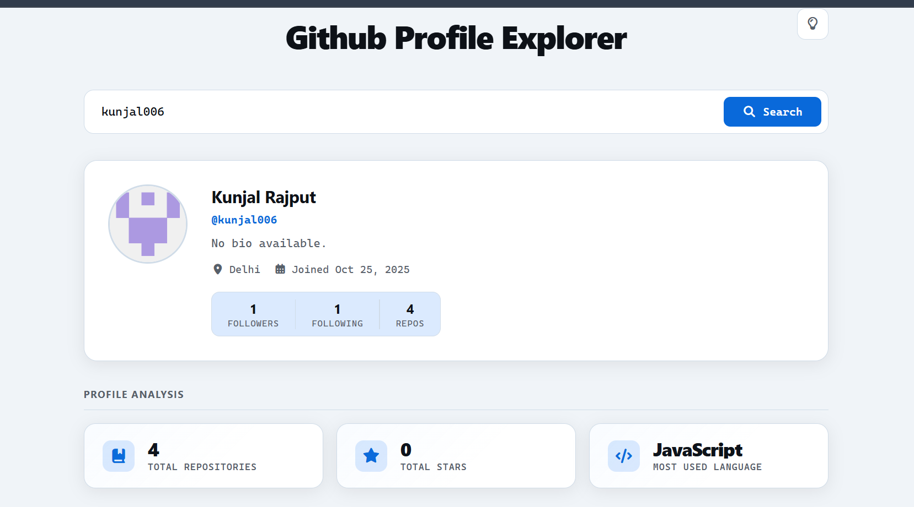

# 🔍 GitHub Profile Explorer

A simple and clean web application to search and explore GitHub user profiles, repositories, and stats using the GitHub API.
It fetches the details of the user from the Github website and displays it on this web applications.

---

## 🚀 Features

- 🔎 Search any GitHub username  
- 👤 View user profile details like
  1. Name
  2. Bio
  3. Display Picture
  4. Followers
  5. Following
  6. Repositories count
  7. Date Joined
  8. Location
  9. Website links
- 📦 Display repositories  
- 🌙 Dark & Light mode support  
- ⚡ Fast and responsive UI  

---

## 🛠️ Tech Stack

- HTML  
- CSS  
- JavaScript  
- GitHub REST API  

---

## 📸 Screenshots

### 🌙 Dark Mode


### ☀️ Light Mode


---

## 📂 Project Structure
├── index.html
├── style.css
├── script.js


---

## ⚙️ How to Run Locally

1. Clone the repository
git clone https://github.com/kunjal006/github-profile-explorer.git

2. Navigate to the project directory
cd github-profile-explorer

3. Open the project
   - open index.html in your browser
  

```
